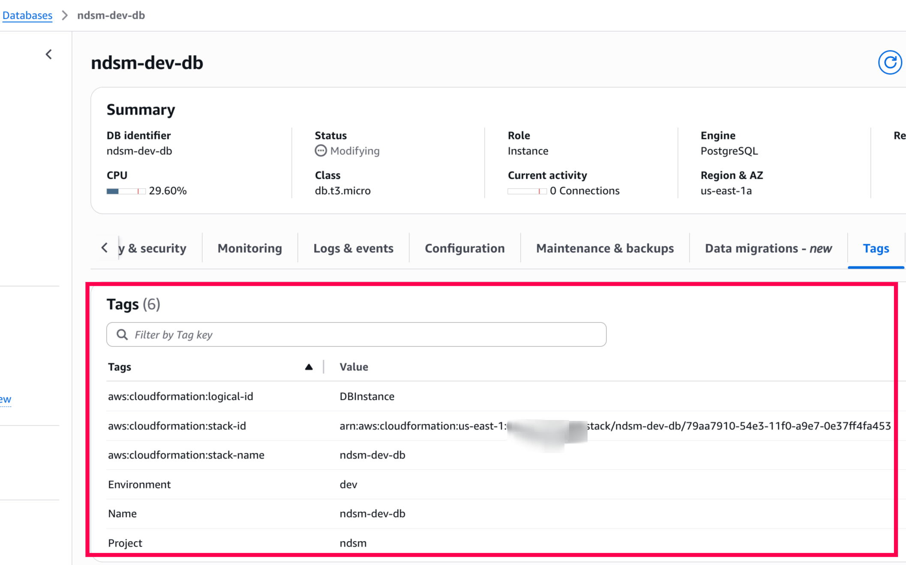

# AWS Multi-Tier Infrastructure Platform

Streamlined infrastructure deployment with [CloudFormation](https://aws.amazon.com/cloudformation/) IaC, [GitHub Actions](https://docs.github.com/en/actions) CI/CD, and built-in security best practices across environments. Extensible to deploy multi-environment infrastructure across AWS accounts.

## Table of Contents

1. [Overview](#overview)
2. [Repository Structure](#repository-structure)
3. [Key Features Implemented](#key-features-implemented)
4. [Enhancement Opportunities (WIP)](#enhancement-opportunities-wip)
5. [Challenges Faced](#challenges-faced)
6. [General Cost Optimization Opportunities in AWS](#general-cost-optimization-opportunities-in-aws)
7. [Prerequisites](#prerequisites)
8. [Demo](#demo)
   - [Environment Configuration](#environment-configuration)
   - [GitHub Actions Pipeline Stages](#github-actions-pipeline-stages)
   - [AWS CloudFormation Stacks Created](#aws-cloudformation-stacks-created)
   - [Infrastructure Resources Created](#infrastructure-resources-created)

## Overview


The CI/CD pipeline follows a sequential execution model: Lint/Scan → Dev → Staging → Production. 

Each stage must complete successfully before the next begins, ensuring quality gates and preventing broken deployments from propagating through environments.

## Repository Structure

```
.
├── .github/workflows/          # GitHub Actions CI/CD orchestration
│   ├── main.yml               # Main orchestrator workflow
│   ├── lint-and-scan.yml      # Security and quality checks
│   └── deploy-*.yml           # Environment-specific deployments
│
├── .github/actions/           # GitHub Composite Actions for workflow optimization
│   ├── setup-aws/            # Reusable AWS credentials configuration
│   └── deploy-cloudformation/ # Reusable CloudFormation deployment logic
│
├── .checkov/                  # Custom security policies
│   └── custom-policy.yaml    # Organization-specific compliance rules
│
├── bootstrap/                 # Initial setup and OIDC configuration
│   ├── README.md             # Detailed setup instructions
│   └── gha-oidc.yaml         # GitHub OIDC provider template
│
├── templates/                 # Modular CloudFormation templates
│   ├── vpc.yaml              # Network/VPC layer
│   ├── alb.yaml              # ALB layer
│   ├── app.yaml              # Application layer
│   └── db.yaml               # Database layer
│
└── parameters/               # Environment-specific configurations
    ├── dev/                  # Development parameters
    ├── staging/              # Staging parameters
    └── prod/                 # Production parameters
```

## Key Features Implemented

1. **Security-First Approach & DevSecOps Culture**
   - ✅ **[Shift-left security](https://www.fortinet.com/resources/cyberglossary/shift-left-security)**: Security safeguards embedded at the beginning of CI/CD pipeline (Lint/Scan stage)
   - ✅ [OIDC authentication using GitHub + AWS](https://docs.github.com/en/actions/how-tos/security-for-github-actions/security-hardening-your-deployments/configuring-openid-connect-in-amazon-web-services) replaces IAM access keys for secure, temporary credentials
   - ✅ Dedicated IAM roles per environment with least-privilege access
   - ✅ Zero static credentials stored in GitHub or code
   - ✅ Custom [Checkov](https://www.checkov.io/) policies enable organization-specific compliance enforcement alongside default policies

2. **Modular Design**
   - ✅ Each infrastructure layer (VPC, ALB, App, DB) deployed via separate templates
   - ✅ Cross-stack references provide loose coupling between components
   - ✅ Environment isolation achieved with separate parameter files
   - ✅ Independent lifecycle management for each stack

3. **GitHub Actions Pipeline with Embedded Security**
   - ✅ **[DevSecOps](https://www.fortinet.com/resources/cyberglossary/devsecops) implementation**: Enforced Lint/Scan → Dev → Staging → Production flow with security gates preventing deployment of non-compliant infrastructure
   - ✅ Reusable workflows for modular CI/CD operations
   - ✅ **Shift-left security scanning**: [CFN-Lint](https://github.com/aws-cloudformation/cfn-lint), [Checkov](https://www.checkov.io/) (Policy as Code with default + custom policies), and [TruffleHog](https://github.com/trufflesecurity/trufflehog) (Secrets scanner) run before any deployment
   - ✅ Environment-specific deployment workflows with proper job dependencies
   - ✅ Environment-specific secrets stored in GitHub Actions (e.g., AWS IAM Role ARNs, RDS DB passwords)
   - ✅ **GitHub Composite Actions**: Optimized workflows using [GitHub Composite Actions](https://docs.github.com/en/actions/creating-actions/creating-a-composite-action) to eliminate code duplication and improve maintainability across deployment workflows

4. **Multi-AZ Architecture**
   - ✅ VPC with 3×3 subnet design deployed across 3 availability zones
   - ✅ Network segmentation:
     - Public subnets for ALB (internet-facing load balancer)
     - Private subnets for application servers (no direct internet access)
     - Database subnets for RDS instances (isolated from internet)
   - ✅ Multi-AZ RDS deployment for high availability and automatic failover
   - ✅ NAT Gateways in each AZ for redundant internet access

5. **Security & Compliance**
   - ✅ [VPC Flow Logs](https://docs.aws.amazon.com/vpc/latest/userguide/flow-logs.html) with [KMS](https://aws.amazon.com/kms/) encryption and configurable retention
   - ✅ KMS encryption for RDS and CloudWatch Logs (EBS encryption relies on account defaults)
   - ✅ [IMDSv2](https://docs.aws.amazon.com/AWSEC2/latest/UserGuide/configuring-instance-metadata-service.html) enforcement on EC2 instances for metadata security
   - ✅ SSL/TLS enforcement for database connections
   - ✅ Security groups with least-privilege access patterns: **ALB → Application servers → RDS servers**
   - ✅ Termination protection automatically enabled for production stacks

6. **Monitoring & Operations with Governance**
   - ✅ Auto Scaling Groups with CloudWatch alarms for CPU-based scaling
   - ✅ RDS Performance Insights enabled for production environments
   - ✅ Automated database backups with environment-specific retention periods
   - ✅ **Comprehensive tagging strategy**: Enforces governance through standardized tags enabling cost attribution, resource filtering by project/product, and custom automation capabilities
   - ✅ Stack dependency management with proper deployment ordering

## Enhancement Opportunities (WIP)

- [AWS Secrets Manager](https://aws.amazon.com/secrets-manager/) integration for enhanced RDS password rotation
- [Parameter Store](https://docs.aws.amazon.com/systems-manager/latest/userguide/systems-manager-parameter-store.html) integration for configuration management (currently using environment-specific parameter files in git)
- Explicit EBS encryption configuration (currently relies on account defaults)
- Advanced GitHub Actions workflow patterns (matrix strategies, dynamic workflows) for disaster recovery
- Manual approval based workflow for production environment deployment
- ✅ Pin GitHub Actions versions with commit hash rather than tags for enhanced security
- Resolve Checkov skip checks to eliminate security exceptions and improve compliance posture


## Challenges Faced

- OIDC configuration complexity with GitHub trust relationships
  - [GitHub Actions Update on OIDC Integration with AWS](https://github.blog/changelog/2023-06-27-github-actions-update-on-oidc-integration-with-aws/) was helpful
- Cross-stack dependency management and deployment ordering
- GitLeaks licensing requirements led to choosing TruffleHog for secrets scanning

## Prerequisites

- Basic knowledge of CloudFormation, GitHub Actions, and AWS
- Complete setup instructions available in the [bootstrap README](bootstrap/README.md)

## Demo

**Note:** Prerequisites should be set up (i.e., OIDC and IAM role for GitHub Actions to assume in dev account) before running the pipeline.

This section showcases the different stages of the GitHub Actions CI/CD pipeline and the AWS resources created through the CloudFormation templates.

### Environment Configuration

| Environment | VPC CIDR    | EC2 Type  | RDS Type     | Auto Scaling |
|-------------|-------------|-----------|--------------|-------------|
| Development | 10.0.0.0/16 | t3.micro  | db.t3.micro  | 1-2 (1)     |
| Staging     | 10.1.0.0/16 | t3.small  | db.t3.small  | 2-4 (2)     |
| Production  | 10.2.0.0/16 | m5.large  | db.r5.large  | 3-10 (3)    |

### GitHub Actions Pipeline Stages

- **Pipeline Execution**: The CI/CD pipeline executes through distinct stages as shown below:
  
  
  
  Sequential execution model with stages:
  1. **Lint and Scan**: Security and quality checks using CFN-Lint, Checkov, and TruffleHog
  2. **Development**: Automated deployment to dev environment after successful validation
  3. **Staging**: Deployment to staging environment following dev success
  4. **Production**: Deployed automatically after staging is successfully deployed

### AWS CloudFormation Stacks Created

- **Infrastructure Organization**: Modular stacks as shown in AWS Console:
  
  
  
  Demonstrates modular approach with separate stacks for VPC, ALB, Application, and Database layers, enabling independent lifecycle management and easier troubleshooting.

### Infrastructure Resources Created

- **Key AWS Resources**: Created by CloudFormation templates:
  
  **VPC and Subnets:**
  
  
  Multi-AZ architecture with public subnets for ALB, private subnets for application servers, and database subnets for RDS instances.
  
  **RDS Database:**
  
  
  RDS console showcasing resource tagging strategy for consistent cost allocation and resource management across infrastructure components.

## General Cost Optimization Opportunities in AWS

### 1. Network Costs
- **[VPC Endpoints](https://docs.aws.amazon.com/vpc/latest/privatelink/concepts.html#concepts-vpc-endpoints)**: Add S3 and DynamoDB VPC endpoints to eliminate NAT Gateway data transfer costs
- **Single NAT Gateway**: Use one NAT Gateway instead of three for non-production environments
- **CloudWatch Logs Retention**: Set appropriate log retention periods (7 days dev, 30 days staging, 90 days prod)

### 2. Compute Optimization
- **[Graviton Instances](https://aws.amazon.com/ec2/graviton/)**: Migrate to ARM-based EC2 Graviton servers as they offer cheaper compute costs
- **Resource Right-sizing**: Use [AWS Fargate](https://aws.amazon.com/fargate/) for containerized workloads to eliminate EC2 instance management overhead and get more granular, pay-per-use pricing
- **Scheduled Scaling**: Implement time-based scaling to shut down dev/staging environments during weekends
- **AWS Compute Optimizer**: Use [AWS Compute Optimizer](https://aws.amazon.com/compute-optimizer/) to identify over-provisioned EC2 instances and right-size workloads

### 3. Storage Optimization
- **gp3 EBS Volumes**: Upgrade from gp2 to gp3 volumes for better cost-performance ratio
- **EBS Snapshot Lifecycle**: Implement automated snapshot deletion after 30 days for dev, 90 days for staging
- **S3 Storage Tiering**: Implement [S3 Lifecycle policies](https://docs.aws.amazon.com/AmazonS3/latest/userguide/object-lifecycle-mgmt.html) or S3 Intelligent Tiering for application data/logs
- **RDS Storage Autoscaling**: Enable storage autoscaling to avoid over-provisioning

### 4. Database Optimization
- **Reserved Instances**: With predictable, steady-state usage, RDS Reserved Instances can provide savings
- **Backup Retention**: Reduce backup retention to 7 days for dev, 14 days for staging

### 5. Automation & Optimization
- **Lambda Resource Cleanup**: Deploy Lambda functions to automatically identify and delete orphaned resources (unused EIPs, unattached EBS volumes, idle load balancers)
- **Cost Anomaly Detection**: Enable [AWS Cost Anomaly Detection](https://docs.aws.amazon.com/awsaccountbilling/latest/aboutv2/getting-started-ad.html) for automated spending alerts

### 6. Monitoring & Alerting
- **Governance Through Tagging**: Comprehensive standardized tags enable cost allocation by project/product, automated resource management, and compliance tracking
- **Unused Resource Detection**: Regular audits for idle load balancers, unattached EBS volumes
- **Establish FinOps Culture**: Implement cost awareness and optimization practices across teams

